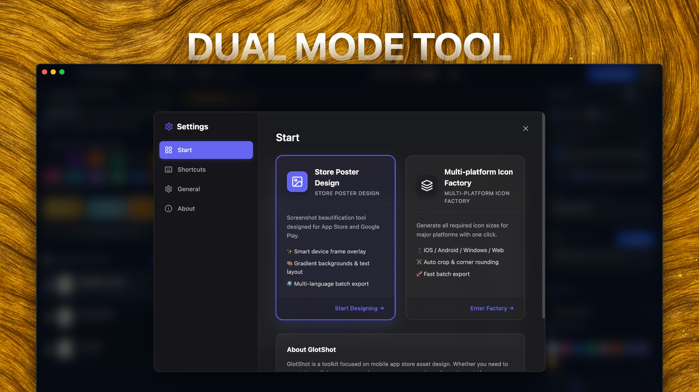
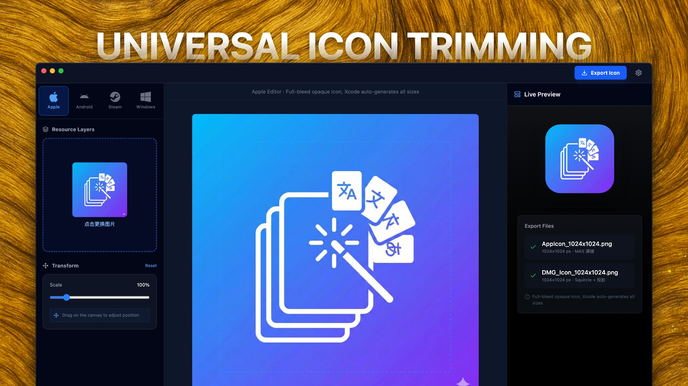

<div align="center">


# GlotShot
### Create Perfect App Store Preview Images
[🌐 Official Website](https://hooosberg.github.io/GlotShot/)

[](https://github.com/hooosberg/GlotShot/releases/latest)
[](https://github.com/hooosberg/GlotShot/releases/latest)
[](https://github.com/hooosberg/GlotShot/releases/latest)

[](https://electronjs.org/)
[](https://reactjs.org/)
[](https://vitejs.dev/)
[](LICENSE)

[English](README.md) | [简体中文](i18n/README.zh-CN.md) | [Español](i18n/README.es.md) | [日本語](i18n/README.ja.md) | [한국어](i18n/README.ko.md) | [Français](i18n/README.fr.md) <br> [Deutsch](i18n/README.de.md) | [Italiano](i18n/README.it.md) | [Português](i18n/README.pt.md) | [Русский](i18n/README.ru.md) | [العربية](i18n/README.ar.md) | [हिन्दी](i18n/README.hi.md)

</div>

---

## 🚀 Introduction

**GlotShot** is a powerful tool designed for mobile app developers and designers to create stunning **App Store** and **Google Play** preview images (screenshots) and icons effortlessly. 

With built-in support for **localization** and **batch processing**, GlotShot helps you expand your app's global reach by generating professional marketing assets in minutes.


## 📸 Screenshots

<div align="center">
  
  
  
</div>

## ✨ Features

- **🎨 Dual Design Modes**: Switch seamlessly between **Poster Design** for screenshots and **Icon Design** for app icons.
- **🌍 Multi-Platform Support**: Generate assets compliant with **iOS (App Store)**, **Android (Google Play)**, **macOS**, and **Windows** standards.
- **⚡ Batch Processing**: Create screenshots for multiple devices and languages in one go. Save hours of manual work.
- **🤖 AI-Powered Translations**: Integrate with **Ollama** for local, privacy-focused translations of your marketing copy into multiple languages.
- **🖼️ Icon Fabric**: Automatically crop and export app icons for all major platforms from a single source image. Smart scaling included.
- **📦 Smart Export**: Export your assets organized by platform and language, ready for upload.

## 📥 Installation

### macOS
1. Go to the [Releases](https://github.com/hooosberg/GlotShot/releases/latest) page.
2. Download the latest `.dmg` file.
3. Open the disk image and drag **GlotShot** to your Applications folder.

### Windows
1. Go to the [Releases](https://github.com/hooosberg/GlotShot/releases/latest) page.
2. Download the latest `.exe` installer.
3. Run the installer to setup GlotShot.

### Linux
1. Go to the [Releases](https://github.com/hooosberg/GlotShot/releases/latest) page.
2. Download the `.AppImage` or `.deb` file.
3. For `.AppImage`, make it executable (`chmod +x GlotShot-*.AppImage`) and run it.

## 💻 System Requirements

| OS | Minimum Requirements | Recommended |
|----|----------------------|-------------|
| **macOS** | macOS 11.0 (Big Sur) or later | Apple Silicon (M1/M2/M3) |
| **Windows** | Windows 10 (64-bit) | Windows 11 |
| **Linux** | Ubuntu 20.04+ (or compatible) | Latest LTS Release |

- **RAM**: 4GB minimum, 8GB recommended.
- **Storage**: 500MB free space.

## 🛠️ Development

GlotShot is built with **Electron**, **React**, and **Vite**.

### Prerequisites

- Node.js (v18 or later)
- npm or pnpm

### Getting Started

1. Clone the repository:
   ```bash
   git clone https://github.com/hooosberg/GlotShot.git
   ```
2. Install dependencies:
   ```bash
   cd GlotShot
   npm install
   ```
3. Run in development mode:
   ```bash
   npm run dev
   ```
4. Build for production:
   ```bash
   npm run build
   npm run electron:build
   ```

## 🤝 Contributing

Contributions are welcome! Please feel free to submit a Pull Request.


## 📧 Contact

**Email**: zikedece@proton.me

## 📄 License & Privacy

- **License**: This project is licensed under the MIT License - see the [LICENSE](LICENSE) file for details.
- **Privacy**: We respect your privacy. See our [Privacy Policy](PRIVACY.md).

---

<div align="center">
Developed with ❤️ by <a href="https://github.com/hooosberg">hooosberg</a>
</div>
