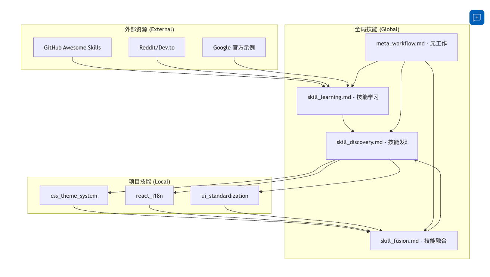

# 📖 开发日志：让软件能够自我学习和进化

> 记录时间：2026-01-16
> 作者：Maohuhu

## 技巧 1：关于让软件自己学习和整理全局和局部 Skill
Google Antigravity 的 Skills 系统（技能系统）确实是其核心亮点，它允许开发者将特定的开发流程（如“代码审查”、“安全审计”、“数据库迁移”）封装成可复用的 `.md` 规则或脚本。

目前的 Skills 分享主要集中在开源社区（GitHub）和特定的开发者论坛。以下是目前最值得关注的公开资源和技巧分享渠道，你可以直接从中借鉴：

### 1. 核心 Skills 资源库 (GitHub)

这是获取现成 Skills 最直接的地方。社区通常会整理“Awesome”列表，你可以直接下载这些仓库中的 `SKILL.md` 文件并在你的 Antigravity 项目中引用。

* **Antigravity Awesome Skills (聚合库)**
* **内容：** 这是一个社区驱动的聚合库，整理了数十种常用 Skills，涵盖了全栈开发、测试编写、文档生成等。
* **推荐理由：** 类似于 "Awesome Python" 的列表，适合新手快速淘金。你可以找到像 `git-commit-formatter` (自动规范提交信息) 或 `test-case-generator` (自动生成测试用例) 这样的实用技能。
* **搜索关键词：** `github antigravity-awesome-skills` 或 `sickn33/antigravity-awesome-skills`

* **Google Cloud / Antigravity 官方示例**
* **内容：** Google 官方提供的标准 Skills 范例，通常包含最佳实践，例如如何编写规范的 Prompt 规则，如何安全地调用 Terminal。
* **推荐理由：** 学习编写 Skills 标准语法的最佳教材，特别是关于 `SKILL.md` 的结构（Goal, Instructions, Constraints）。
* **资源地址：** 通常在 `antigravity.google/docs/skills` 文档中引用，或在 GitHub 搜索 `rominirani/antigravity-skills`。

### 2. 开发者社区与讨论区

技巧和“黑科技”玩法的集中地。

* **Reddit (r/google_antigravity)**
* **内容：** 极其活跃的社区。开发者会在这里分享自己编写的 Custom Skills，或者讨论如何“绕过”某些限制的 Prompt 技巧。
* **寻找技巧：** 搜索标签（Flair）为 "Skills" 或 "Showcase" 的帖子。

* **Dev.to & Medium 技术博客**
* **内容：** 很多资深开发者（如 GDE - Google Developer Experts）会撰写深度教程，拆解如何将 Antigravity 集成到 Unity、React 等特定工作流中。
* **推荐文章类型：** 搜索 "Antigravity workflow for [你的技术栈]" (例如 "Antigravity workflow for React")。

### 3. Skills 开发技巧速查 (如何“借鉴”)

当你下载了别人的 Skills 后，建议按以下方式“借鉴”到你的项目中：

1. **理解结构 (SKILL.md)**：
* 查看 **Brain (规则)**：在 `SKILL.md` 中查看 `Instructions` 部分，这是告诉 Agent "如何思考" 的核心 Prompt。
* 查看 **Hands (工具)**：查看它调用了哪些 MCP (Model Context Protocol) 工具，比如是调用了本地 Shell 还是浏览器。

2. **本地复用 (Workspace vs Global)**：
* 如果你想让某个技巧在所有项目通用（比如代码风格检查），将其放入全局目录（通常是 `~/.gemini/antigravity/skills/`）。
* 如果你只是想在当前项目借鉴，将其放入项目根目录的 `.agent/skills/` 下。

### 总结建议

建议你从 **GitHub 上的 `antigravity-awesome-skills**` 开始。先 clone 下来，观察别人是如何写 `SKILL.md` 的，然后尝试把其中通用的（如 `Auto-Documentation`）复制到你的 `.agent/skills` 文件夹里跑通一次，这是最快的上手路径。

[Google Antigravity: From Beginner to Expert in 16 Minutes!](https://www.youtube.com/watch?v=LB_cFL_nQbc)
这个视频非常适合快速入门，第 12 分钟左右开始详细演示了如何实际导入和使用 Skills，能让你直观看到借鉴公开技巧后的效果。根据以上的原则帮我这个在全局技巧下设置一些通用技巧。来提升整个技巧流程的自我学习过程。也就是说，每一次这个改进我提到要改进技巧的时候，就可以到这个外部网站上去搜寻相关的技巧，然后来添加到本地的一个全居技巧。然后局部技巧也会有一些非常好的联动。就是说这个局部技巧和这个全局技巧之间也有一些联动。全局技巧和这个外部技巧，网络技巧也有一些联动。在优化项目的过程中层层递进，一步步前后思考。一个技巧框架的设置由你来决定。

全局技能自学习框架设计
设计一个层级化的技能管理系统，实现外部网络技能 → 全局技能 → 项目技能的三层递进式学习和应用。

🧠 智能路由器
现在 AI 会自动根据你的任务类型选择合适的技能：

你说	AI 自动应用
"修改按钮样式"	ui_standardization
"添加多语言"	react_i18n
"打包发布"	security_check → build_*
"搜索技能"	skill_discovery
无需手动指定技能，路由器会在后台自动匹配！

通过自动化的skill 发现开发速度和准确度都提高了。