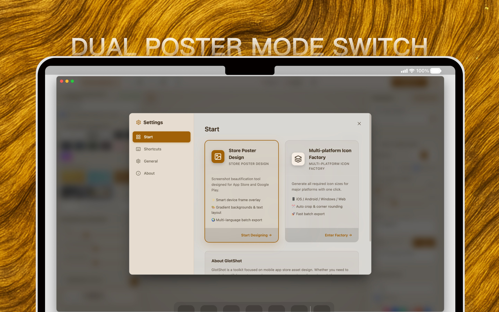
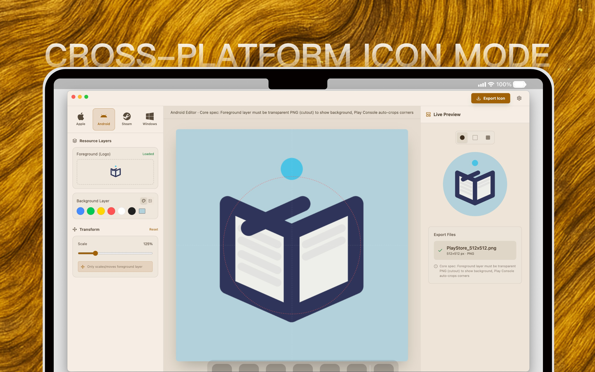
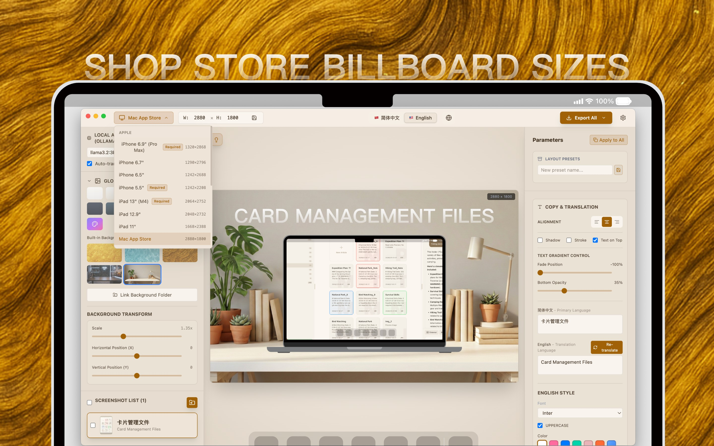

# GlotShot
### ऐप स्टोर पूर्वावलोकन छवि जनरेटर
[🌐 आधिकारिक वेबसाइट](https://hooosberg.github.io/GlotShot/)

[English](../README.md) | [简体中文](README.zh-CN.md) | [Español](README.es.md) | [日本語](README.ja.md) | [한국어](README.ko.md) | [Français](README.fr.md)   [Deutsch](README.de.md) | [Italiano](README.it.md) | [Português](README.pt.md) | [Русский](README.ru.md) | [العربية](README.ar.md) | [हिन्दी](README.hi.md)

---

## 🚀 परिचय

**GlotShot** एक शक्तिशाली उपकरण है जिसे मोबाइल ऐप डेवलपर्स और डिजाइनरों के लिए **ऐप स्टोर** और **Google Play** के लिए आश्चर्यजनक पूर्वावलोकन चित्र (स्क्रीनशॉट) और आइकन आसानी से बनाने के लिए डिज़ाइन किया गया है।

**स्थानीकरण** और **बैच प्रोसेसिंग** के लिए अंतर्निहित समर्थन के साथ, GlotShot आपको मिनटों में पेशेवर मार्केटिंग संपत्ति उत्पन्न करके अपने ऐप की वैश्विक पहुंच का विस्तार करने में मदद करता है।

## 🍎 Mac App Store और मूल्य निर्धारण

> **शुरुआती उपयोगकर्ताओं के लिए नोट:**
> हम वर्तमान में **Mac App Store** के लिए आवेदन कर रहे हैं। एक बार स्वीकृत होने के बाद, GlotShot शुरुआती उपयोगकर्ताओं के लिए **मुफ़्त** होगा।
> बाद में यह एक सशुल्क ऐप बन जाएगा, लेकिन **शुरुआती उपयोगकर्ता इसे हमेशा के लिए मुफ़्त रखेंगे**।
>
> हमारी प्रगति का पालन करने के लिए कृपया इस परियोजना को **[Star ★](https://github.com/hooosberg/GlotShot)** दें! यदि ऐप स्टोर पर सूचीबद्ध किया जाता है, तो हम तुरंत सभी को सूचित करेंगे।
>
> *अन्य संस्करणों के उपयोगकर्ता इसे हमेशा स्वयं बना सकते हैं.*

## 📸 स्क्रीनशॉट

  
  
  

## ✨ विशेषताएँ

- **🎨 दोहरा डिज़ाइन मोड**: स्क्रीनशॉट के लिए **पोस्टर डिज़ाइन** और ऐप आइकन के लिए **आइकन डिज़ाइन** के बीच निर्बाध रूप से स्विच करें।
- **🌍 मल्टी-प्लेटफ़ॉर्म समर्थन**: **iOS (App Store)**, **Android (Google Play)**, **macOS**, और **Windows** मानकों के अनुरूप संपत्ति उत्पन्न करें।
- **⚡ बैच प्रोसेसिंग**: एक ही बार में कई उपकरणों और भाषाओं के लिए स्क्रीनशॉट बनाएं। घंटों की मेहनत बचाएं।
- **🤖 AI अनुवाद**: अपनी मार्केटिंग कॉपी के स्थानीय, गोपनीयता-केंद्रित अनुवादों के लिए **Ollama** को कई भाषाओं में एकीकृत करें।
- **🖼️ आइकन फ़ैब्रिक**: एकल स्रोत छवि से सभी प्रमुख प्लेटफ़ॉर्म के लिए ऐप आइकन स्वचालित रूप से क्रॉप और निर्यात करें।
- **💎 आधुनिक UI**: एक चिकना, डार्क-मोड इंटरफ़ेस जिसमें ग्लासमोर्फ़िज़्म प्रभाव हैं, जिसे देशी macOS अनुभव के लिए डिज़ाइन किया गया है।
- **📦 स्मार्ट निर्यात**: अपनी संपत्ति को प्लेटफ़ॉर्म और भाषा द्वारा व्यवस्थित करके निर्यात करें, अपलोड के लिए तैयार।

## 📥 स्थापना

### macOS
1. [Releases](https://github.com/hooosberg/GlotShot/releases/latest) पृष्ठ पर जाएं।
2. नवीनतम `.dmg` फ़ाइल डाउनलोड करें।
3. डिस्क इमेज खोलें और **GlotShot** को अपने एप्लिकेशन फ़ोल्डर में खींचें।

## 🤝 योगदान

योगदान का स्वागत है! कृपया बेझिझक पुल रिक्वेस्ट सबमिट करें।

## 📖 विकास डायरी

क्या आप जानना चाहते हैं कि GlotShot कैसे बनाया गया है? हमारे विकास लॉग देखें:
- [विकास डायरी: सॉफ्टवेयर को स्वयं सीखने और विकसित करने में सक्षम बनाना](../docs/dev-diaries/dev-diary.md)

## 📄 लाइसेंस

यह प्रोजेक्ट MIT लाइसेंस के तहत लाइसेंस प्राप्त है - विवरण के लिए [LICENSE](../LICENSE) फ़ाइल देखें।

---

<a href="https://github.com/hooosberg">hooosberg</a> द्वारा ❤️ के साथ विकसित

