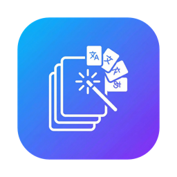

# GlotShot
### Generatore di Immagini di Anteprima per App Store
[🌐 Sito Ufficiale](https://hooosberg.github.io/GlotShot/)

[English](../README.md) | [简体中文](README.zh-CN.md) | [Español](README.es.md) | [日本語](README.ja.md) | [한국어](README.ko.md) | [Français](README.fr.md)   [Deutsch](README.de.md) | [Italiano](README.it.md) | [Português](README.pt.md) | [Русский](README.ru.md) | [العربية](README.ar.md) | [हिन्दी](README.hi.md)

---

## 🚀 Introduzione

**GlotShot** è un potente strumento progettato per sviluppatori e designer di app mobili per creare facilmente immagini di anteprima (screenshot) e icone mozzafiato per **App Store** e **Google Play**.

Con supporto integrato per la **localizzazione** e l'**elaborazione in batch**, GlotShot ti aiuta a espandere la portata globale della tua app generando risorse di marketing professionali in pochi minuti.

## 🍎 Mac App Store e Prezzi

> **GlotShot is now available on the [Mac App Store](https://apps.apple.com/us/app/glotshot-screenshot-maker/id6757913340?mt=12)!**
> 
> The App Store version is always the most up-to-date. One-time purchase, no subscription.
> 
> *Users of other platforms can download from [GitHub Releases](https://github.com/hooosberg/GlotShot/releases/latest) or build from source.*

## 📸 Screenshot

  
  
  

## ✨ Funzionalità

- **🎨 Doppia Modalità di Design**: Passa senza problemi tra **Design Poster** per gli screenshot e **Design Icona** per le icone delle app.
- **🌍 Supporto Multi-Piattaforma**: Genera risorse conformi agli standard di **iOS (App Store)**, **Android (Google Play)**, **macOS** e **Windows**.
- **⚡ Elaborazione in Batch**: Crea screenshot per più dispositivi e lingue in una volta sola. Risparmia ore di lavoro manuale.
- **🤖 Traduzione AI**: Integra **Ollama** per traduzioni locali e private dei tuoi testi di marketing in più lingue.
- **🖼️ Fabbrica di Icone**: Ritaglia ed esporta automaticamente le icone delle app per tutte le principali piattaforme da una singola immagine sorgente.
- **💎 UI Moderna**: Un'interfaccia elegante in modalità scura con effetti vetro smerigliato, progettata per una sensazione nativa macOS.
- **📦 Esportazione Intelligente**: Esporta le tue risorse organizzate per piattaforma e lingua, pronte per il caricamento.

## 📥 Installazione

### macOS
1. **[Download from the Mac App Store](https://apps.apple.com/us/app/glotshot-screenshot-maker/id6757913340?mt=12)** — always the latest version.

Or manually via GitHub:

1. Vai alla pagina delle [Release](https://github.com/hooosberg/GlotShot/releases/latest).
2. Scarica l'ultimo file `.dmg`.
3. Apri l'immagine disco e trascina **GlotShot** nella cartella Applicazioni.

## 🤝 Contribuire

I contributi sono benvenuti! Sentiti libero di inviare una Pull Request.

## 📖 Diario di Sviluppo

Interessato a come è costruito GlotShot? Dai un'occhiata ai nostri log di sviluppo:
- [Diario di Dev: Abilitare l'autoapprendimento e l'evoluzione del software](../docs/dev-diaries/dev-diary.md)

## 📄 Licenza

Questo progetto è concesso in licenza sotto la Licenza MIT - vedi il file [LICENSE](../LICENSE) per i dettagli.

---

Sviluppato con ❤️ da <a href="https://github.com/hooosberg">hooosberg</a>

