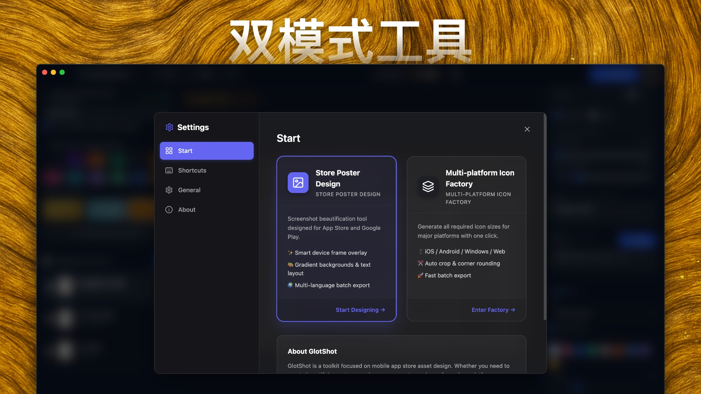
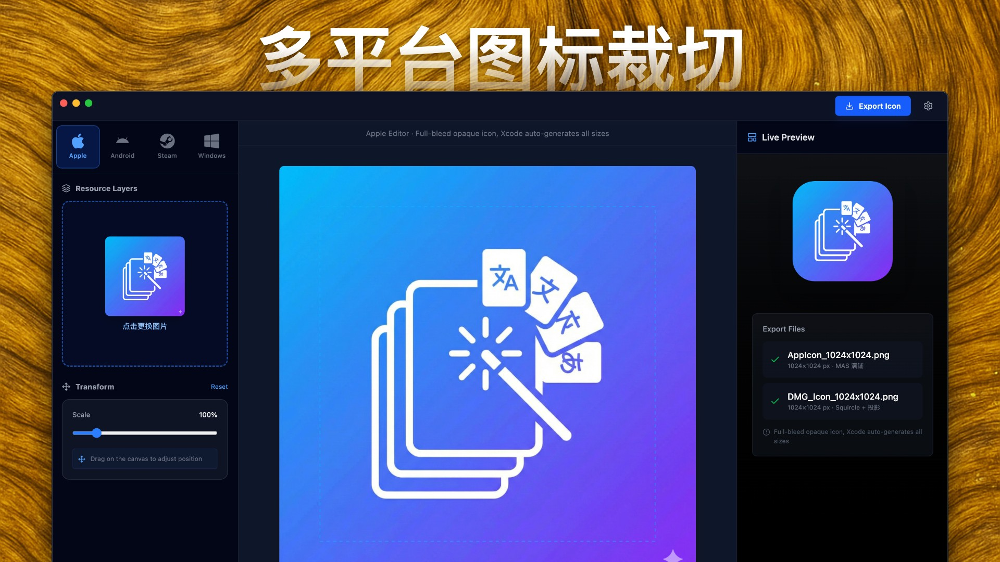
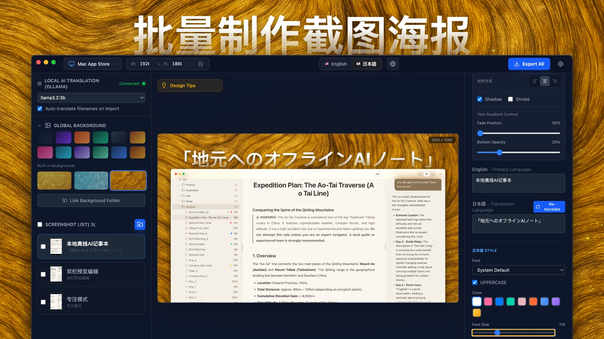

# GlotShot
### Gerador de Imagens de Pré-visualização para App Store
[🌐 Site Oficial](https://hooosberg.github.io/GlotShot/)

[English](../README.md) | [简体中文](README.zh-CN.md) | [Español](README.es.md) | [日本語](README.ja.md) | [한국어](README.ko.md) | [Français](README.fr.md)   [Deutsch](README.de.md) | [Italiano](README.it.md) | [Português](README.pt.md) | [Русский](README.ru.md) | [العربية](README.ar.md) | [हिन्दी](README.hi.md)

---

## 🚀 Introdução

**GlotShot** é uma ferramenta poderosa projetada para desenvolvedores e designers de aplicativos móveis criarem imagens de pré-visualização (capturas de tela) e ícones impressionantes para **App Store** e **Google Play** sem esforço.

Com suporte integrado para **localização** e **processamento em lote**, o GlotShot ajuda você a expandir o alcance global do seu aplicativo gerando ativos de marketing profissionais em minutos.

## 📸 Capturas de Tela

  
  
  

## ✨ Funcionalidades

- **🎨 Modos de Design Duplo**: Alterne perfeitamente entre **Design de Pôster** para capturas de tela e **Design de Ícone** para ícones de aplicativos.
- **🌍 Suporte Multiplataforma**: Gere ativos compatíveis com os padrões **iOS (App Store)**, **Android (Google Play)**, **macOS** e **Windows**.
- **⚡ Processamento em Lote**: Crie capturas de tela para vários dispositivos e idiomas de uma só vez. Economize horas de trabalho manual.
- **🤖 Tradução por IA**: Integre o **Ollama** para traduções locais e privadas do seu texto de marketing para vários idiomas.
- **🖼️ Fábrica de Ícones**: Corte e exporte automaticamente ícones de aplicativos para todas as principais plataformas a partir de uma única imagem fonte.
- **💎 UI Moderna**: Uma interface elegante em modo escuro com efeitos de vidro fosco, projetada para uma sensação nativa do macOS.
- **📦 Exportação Inteligente**: Exporte seus ativos organizados por plataforma e idioma, prontos para upload.

## 📥 Instalação

### macOS
1. Vá para a página de [Lançamentos](https://github.com/hooosberg/GlotShot/releases/latest).
2. Baixe o último arquivo `.dmg`.
3. Abra a imagem de disco e arraste **GlotShot** para a sua pasta Aplicativos.

## 🤝 Contribuição

Contribuições são bem-vindas! Sinta-se à vontade para enviar um Pull Request.

## 📄 Licença

Este projeto está licenciado sob a Licença MIT - veja o arquivo [LICENSE](../LICENSE) para detalhes.

---

Desenvolvido com ❤️ por <a href="https://github.com/hooosberg">hooosberg</a>

